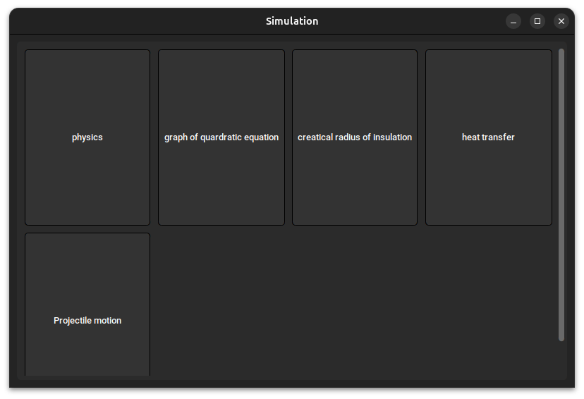
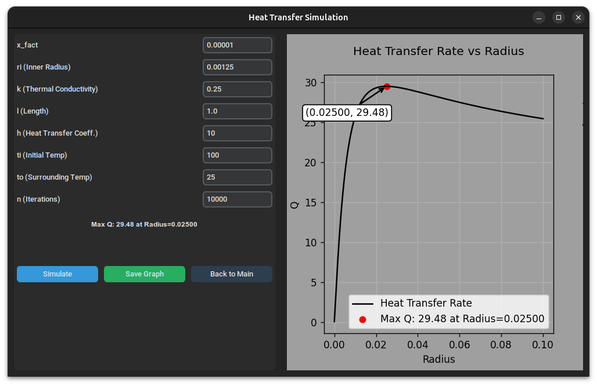

# Simulation Repository

Welcome to the **Simulation** repository! This repository is dedicated to developing various simulations using **Tkinter in Python**. Our goal is to create interactive and visually appealing simulations that can be used for educational and experimental purposes.

## Purpose

This repository serves as a collaborative space for developing **Tkinter-based simulations**. Each simulation is created in an organized manner to ensure reusability and modularity. We encourage contributors to create new branches for different simulations and follow the repository structure.

Website : [Simulation Web App](https://simulation-mbat.web.app/)

## Get Started

To get started with this repository, follow the steps below:

### 1. Clone the Repository

```sh
git clone https://github.com/mbatwc113114/simulation.git
cd simulation
```

### 2. Install Python

Ensure you have **Python 3.8+** installed. You can download it from [Python's official website](https://www.python.org/downloads/).

### 3. Create a Virtual Environment

It is recommended to use a virtual environment to manage dependencies:

```sh
python3 -m venv venv
source venv/bin/activate  # On macOS/Linux
venv\Scripts\activate     # On Windows
```

### 4. Install Dependencies

```sh
pip install -r requirements.txt
```

## Testing

To run the simulation GUI, execute:

```sh
python3 main.py
```





## Contributing

To create a new simulation, follow these steps:

### 1. Create a New Branch

Create a new branch and edit there:

```sh
git checkout -b feature/simulation_name
```

### 2. Use `child_.py` as a Template

All simulations should follow a structured format. Use `child/child_.py` as the base template to ensure consistency.

### 3. Implement Your Simulation

Develop your simulation using **Tkinter** and any additional required libraries. Ensure that the code is well-structured and documented.

### 4. Push Changes and Create a Pull Request

```sh
git add .
git commit -m "Added new simulation: simulation_name"
git push origin feature/simulation_name
```

Then, create a **Pull Request (PR)** for review and merging.

## License

This project is open-source and available under the **MIT License**. A `LICENSE` file is included in the repository with details.

## Contact & Support

For any issues or discussions, open an **Issue** on GitHub or contact the repository maintainers.

Happy Coding! 🚀
